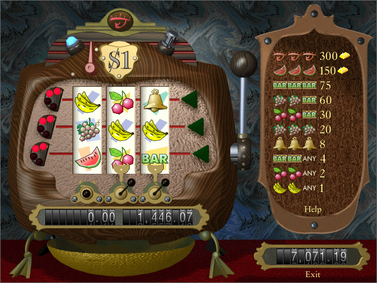

# Slot machine game with fischertechnik and Arduino Mega

This project is heavily inspired by [Hypervisual Century](http://hypervisual.com/century/), a software slots machine game that I developed as a demo for my company back in 1998. From it I've taken the symbol graphics and the lock reels feature, among other ideas.

There are several reference images, diagrams and spreadsheets in the [docs](/docs) folder.

## Mechanics

The mechanics are basically composed of fischertechnik parts. I wanted to build a very compact machine, which means everything should fit on a ft 259×187 plate 500 (part # [32985](https://ft-datenbank.de/tickets?fulltext=32985)).

_To be continued..._

## Controller

The electronics for this project were custom made, but . The main controller is an Arduino Mega with two custom shields, one on top of the other, explained in more detail [here](https://forum.ftcommunity.de/viewtopic.php?f=8&t=8018).

The componentes used to build the controller were:

- **Base module**: Arduino Mega 2560, transparent case, 4 × ft building block 5 [37237](https://ft-datenbank.de/tickets?fulltext=37237)
- **Custom shield**: Mega 2560 proto shield, 3 × DRV8833 motor driver, DFPlayer Mini MP3 player, 1/10" pin headers and sockets
- **ft power shield**: 20 × 80 DIY prototype board, Mini360 step-down converter, 1N4001 diode,  14 × short ft collar sleeves, 1/10" pin headers

## Electronics and other non-ft parts

Other custom electronic modules are listed below along with their components:

- **Custom ft speaker module**: 2 × ft sound module [130589](https://ft-datenbank.de/tickets?fulltext=130589) (speakers), ft [128597](https://ft-datenbank.de/tickets?fulltext=128597) or [133009](https://ft-datenbank.de/tickets?fulltext=133009) ultrasonic distance sensor (case and PCB), ft cable, 2 × 1/10" sockets
- **Power plate:** ft 30×45 red building plate [38248](https://ft-datenbank.de/tickets?fulltext=38248), 2.5 mm power jack, Mini toggle switch
- **Adapter board**: 170-point mini solderless breadboard, DIY prototype board (approx. 42 × 17), 8 × long (20 mm) ft collar sleeves, 16 × 1/10" pin headers, 3 × 4.7kΩ resistors
- 3 × **home position sensors**: HC-020K encoder, 3 mm bolt, 3 mm nut, 3 mm plastic washer, TW3 nylon transistor bushing, ft axis adapter [31422](https://ft-datenbank.de/tickets?fulltext=31422)
- LED matrix module: 24 × 8 MAX7219 LED dot matrix module, transparent red plastic sheet, 2 × ft 15×45 red building plate

Other non-ft parts used were jumper cables, several wires and cables, 25-point micro breadboards, green plastic sheets, printed paper sheets and strips, plastic strips, double-side adhesive tape, spiral cable wrap, electrician tape, hot glue and solder.

## Software

## Related links

- [Best hardware approach for complex project?](https://forum.ftcommunity.de/viewtopic.php?f=8&t=7890) in the fischertechnik community
- [Arduino Mega Controller for fischertechnik](https://forum.ftcommunity.de/viewtopic.php?f=8&t=8018) in the fischertechnik community
- [Hypervisual Century for Windows](http://hypervisual.com/century/files/century_en.zip) (still playable in glorious 640 x 480 pixels with 256-color palette)

## Third-party libraries used

- [arduino-timer](https://github.com/contrem/arduino-timer) Michael Contreras
- [DFRobotDFPlayerMini](https://github.com/DFRobot/DFRobotDFPlayerMini) by Angelo qiao
- [ezButton / ezLED](https://github.com/ArduinoGetStarted) by ArduinoGetStarted
- [MD_MAX72xx](https://github.com/MajicDesigns/MD_MAX72XX) by Marco Colli
- [TrueRandom](https://github.com/sirleech/TrueRandom) by sirleech

## Extras

Includes new font for the MD_MAX72xx library in the [fonts](https://github.com/leosdad/ft-slot-machine/tree/master/slots/src/drivers) folder.
