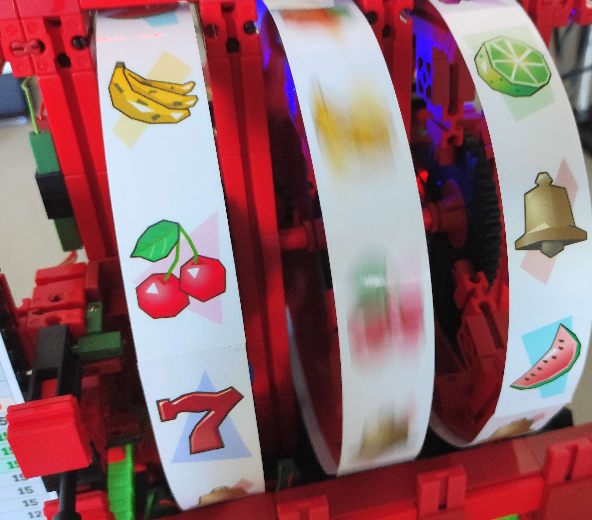

# Slot machine game with fischertechnik and Arduino Mega

This slot machine game is a very complex project I designed, built and developed during many months. This repo contains the code that has made its way into the actual machine. This project is heavily inspired by [Hypervisual Century](http://hypervisual.com/century/), a software slot machine game that I developed as a demo for my company back in 1998.

## Mechanics and gameplay

The slot machine is assembled with [fischertechnik](https://www.fischertechnik.de/en) parts. It has three reels and one payline. In addition to the ability to adjust the bet value, the player can lock one or two reels prior to a spin upon certain conditions. This introduces strategy elements that help to achieve the goal, which is to win hundreds of points in a finite number of spins.

Despite the retro look, all operations are fully motorized and software-based.

## Controller

The main controller is an Arduino Mega with a custom two-layer shield. This arrangement is explained in more detail in the [fischertechnik community forum](https://forum.ftcommunity.de/viewtopic.php?f=8&t=8018). Additional information is available in the [docs](/docs) folder.

## Related links

- [Best hardware approach for complex project?](https://forum.ftcommunity.de/viewtopic.php?f=8&t=7890) in the fischertechnik community
- [Arduino Mega Controller for fischertechnik](https://forum.ftcommunity.de/viewtopic.php?f=8&t=8018) in the fischertechnik community
- [Hypervisual Century for Windows](http://hypervisual.com/century/files/century_en.zip) (still playable in glorious 640 × 480 pixels)

## Third-party libraries and tools

- [arduino-timer](https://github.com/contrem/arduino-timer) by Michael Contreras
- [DFPlayerMini_Fast](https://github.com/PowerBroker2/DFPlayerMini_Fast) by PowerBroker2
- [DriveSort](http://www.anerty.net/software/file/DriveSort/) FAT file sorter by anerty
- [ezButton & ezLED](https://github.com/ArduinoGetStarted) by ArduinoGetStarted
- [FreeSound](https://freesound.org/) audio database
- [MD_MAX72xx](https://github.com/MajicDesigns/MD_MAX72XX) by Marco Colli
- [TrueRandom](https://github.com/sirleech/TrueRandom) by sirleech

## Extras

- There are various reference images, diagrams and spreadsheets in the [docs](/docs) folder.
- Includes a specially designed compact font for the MD_MAX72xx library in the [fonts](https://github.com/leosdad/ft-slot-machine/tree/master/slots/src/drivers) folder.
